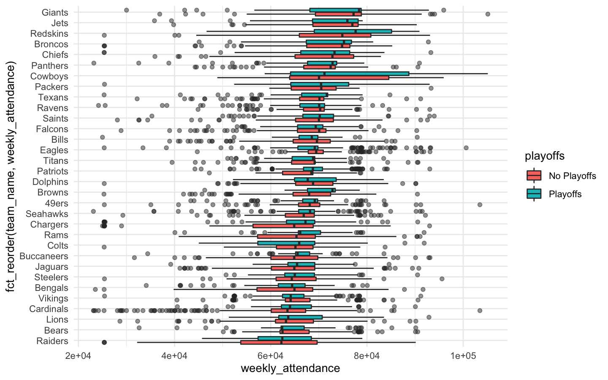
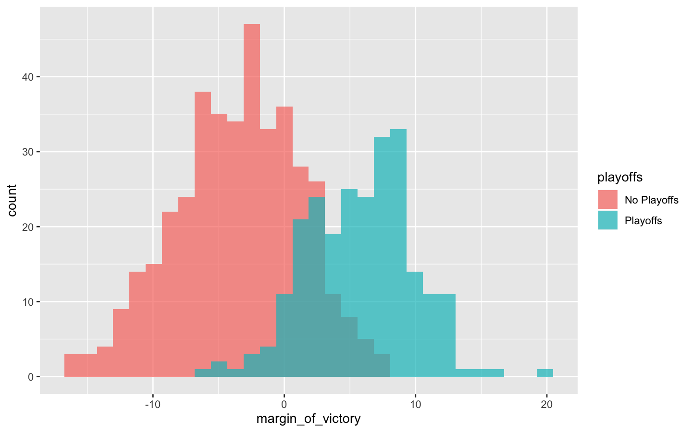
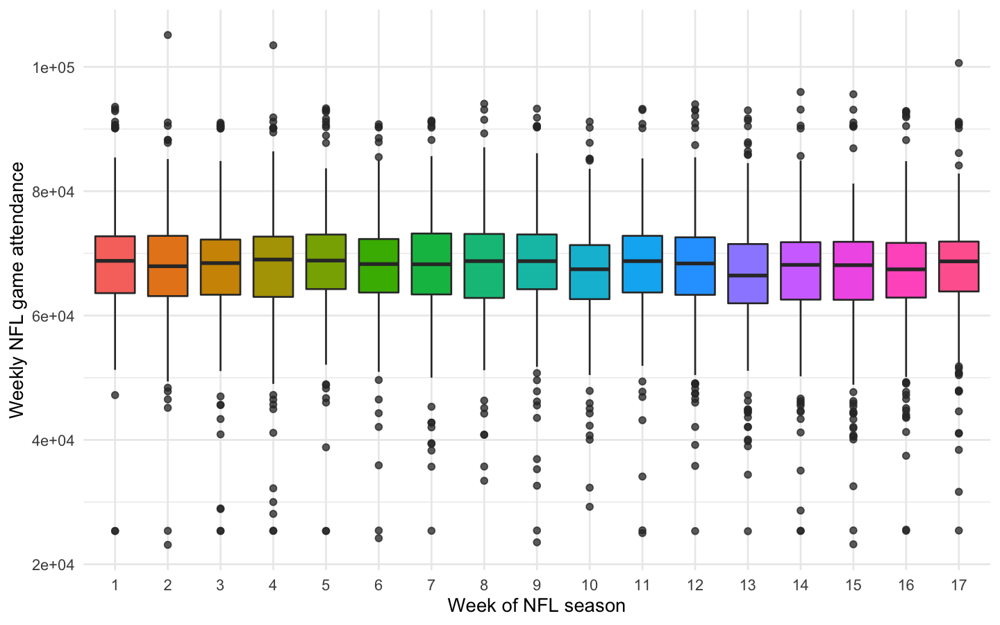

NFL Attendance
================
2020-02-09

## Explore Data

``` r
attendance <-
    read_csv(
        "https://raw.githubusercontent.com/rfordatascience/tidytuesday/master/data/2020/2020-02-04/attendance.csv" , progress = TRUE
    )
standings <-
    read_csv(
        "https://raw.githubusercontent.com/rfordatascience/tidytuesday/master/data/2020/2020-02-04/standings.csv"
    )

attendance_joined <- attendance %>%
    dplyr::left_join(standings,
              by = c("year", "team_name", "team"))

attendance_joined$team_name <- factor(attendance_joined$team_name )
attendance_joined$team <- factor(attendance_joined$team)
attendance_joined$playoffs <- factor(attendance_joined$playoffs)
attendance_joined$sb_winner <- factor(attendance_joined$sb_winner)
```

``` r
attendance_joined %>% filter(!is.na(weekly_attendance)) %>%
    ggplot(aes(x=
    fct_reorder(team_name,weekly_attendance), 
    y=weekly_attendance,
    fill = playoffs), na.rm=TRUE) +
    geom_boxplot(outlier.alpha = 0.5) +
    coord_flip() + theme_minimal()
```

<!-- -->

``` r
attendance_joined %>% distinct(team_name,
                               year, margin_of_victory,
                               playoffs) %>%
  ggplot(aes(margin_of_victory, fill=playoffs
             ))+
    geom_histogram(position = 'identity', alpha=0.7)
```

<!-- -->

``` r
attendance_joined %>%
  mutate(week = factor(week)) %>%
  ggplot(aes(week, weekly_attendance, fill = week)) +
  geom_boxplot(show.legend = FALSE, outlier.alpha = 0.5) +
  labs(
    x = "Week of NFL season",
    y = "Weekly NFL game attendance"
  )+ theme_minimal()
```

<!-- -->

``` r
attendance_df <- attendance_joined %>%
  filter(!is.na(weekly_attendance)) %>%
  select(
    weekly_attendance, team_name, year, week,
    margin_of_victory, strength_of_schedule, playoffs
  )

attendance_df
```

    ## # A tibble: 10,208 x 7
    ##    weekly_attendan… team_name  year  week margin_of_victo… strength_of_sch…
    ##               <dbl> <fct>     <dbl> <dbl>            <dbl>            <dbl>
    ##  1            77434 Cardinals  2000     1            -14.6             -0.7
    ##  2            66009 Cardinals  2000     2            -14.6             -0.7
    ##  3            71801 Cardinals  2000     4            -14.6             -0.7
    ##  4            66985 Cardinals  2000     5            -14.6             -0.7
    ##  5            44296 Cardinals  2000     6            -14.6             -0.7
    ##  6            38293 Cardinals  2000     7            -14.6             -0.7
    ##  7            62981 Cardinals  2000     8            -14.6             -0.7
    ##  8            35286 Cardinals  2000     9            -14.6             -0.7
    ##  9            52244 Cardinals  2000    10            -14.6             -0.7
    ## 10            64223 Cardinals  2000    11            -14.6             -0.7
    ## # … with 10,198 more rows, and 1 more variable: playoffs <fct>

## Train model

``` r
library(tidymodels)
set.seed(1234)
attendance_split <- attendance_df %>%
  initial_split(strata = playoffs)
attendance_split
```

    ## <7656/2552/10208>

``` r
nfl_train <- training(attendance_split)
nfl_test <- testing(attendance_split)

nfl_train
```

    ## # A tibble: 7,656 x 7
    ##    weekly_attendan… team_name  year  week margin_of_victo… strength_of_sch…
    ##               <dbl> <fct>     <dbl> <dbl>            <dbl>            <dbl>
    ##  1            77434 Cardinals  2000     1            -14.6             -0.7
    ##  2            66009 Cardinals  2000     2            -14.6             -0.7
    ##  3            71801 Cardinals  2000     4            -14.6             -0.7
    ##  4            66985 Cardinals  2000     5            -14.6             -0.7
    ##  5            44296 Cardinals  2000     6            -14.6             -0.7
    ##  6            38293 Cardinals  2000     7            -14.6             -0.7
    ##  7            62981 Cardinals  2000     8            -14.6             -0.7
    ##  8            35286 Cardinals  2000     9            -14.6             -0.7
    ##  9            52244 Cardinals  2000    10            -14.6             -0.7
    ## 10            64223 Cardinals  2000    11            -14.6             -0.7
    ## # … with 7,646 more rows, and 1 more variable: playoffs <fct>

``` r
nfl_test
```

    ## # A tibble: 2,552 x 7
    ##    weekly_attendan… team_name  year  week margin_of_victo… strength_of_sch…
    ##               <dbl> <fct>     <dbl> <dbl>            <dbl>            <dbl>
    ##  1            65356 Cardinals  2000    12            -14.6             -0.7
    ##  2            50289 Cardinals  2000    14            -14.6             -0.7
    ##  3            37452 Cardinals  2000    16            -14.6             -0.7
    ##  4            65711 Cardinals  2000    17            -14.6             -0.7
    ##  5            73025 Falcons    2000     3            -10.1              1.5
    ##  6            66019 Falcons    2000     7            -10.1              1.5
    ##  7            44680 Falcons    2000    14            -10.1              1.5
    ##  8            41017 Falcons    2000    17            -10.1              1.5
    ##  9            68481 Ravens     2000     4             10.5             -2.5
    ## 10            83252 Ravens     2000     7             10.5             -2.5
    ## # … with 2,542 more rows, and 1 more variable: playoffs <fct>

``` r
lm_spec <- linear_reg() %>%
  set_engine(engine = "lm")

lm_spec
```

    ## Linear Regression Model Specification (regression)
    ## 
    ## Computational engine: lm

``` r
lm_fit <- lm_spec %>%
  fit(weekly_attendance ~ .,
    data = nfl_train
  )

lm_fit
```

    ## parsnip model object
    ## 
    ## Fit time:  21ms 
    ## 
    ## Call:
    ## stats::lm(formula = formula, data = data)
    ## 
    ## Coefficients:
    ##          (Intercept)        team_nameBears      team_nameBengals  
    ##            -81107.86              -2879.80              -4875.47  
    ##       team_nameBills      team_nameBroncos       team_nameBrowns  
    ##              -361.08               2805.24               -324.11  
    ##  team_nameBuccaneers    team_nameCardinals     team_nameChargers  
    ##             -3063.65              -6139.80              -6489.31  
    ##      team_nameChiefs        team_nameColts      team_nameCowboys  
    ##              1974.33              -3392.79               6068.70  
    ##    team_nameDolphins       team_nameEagles      team_nameFalcons  
    ##               139.68               1259.16               -204.17  
    ##      team_nameGiants      team_nameJaguars         team_nameJets  
    ##              5447.10              -3095.46               4044.23  
    ##       team_nameLions      team_namePackers     team_namePanthers  
    ##             -3480.69               1114.11               1227.32  
    ##    team_namePatriots      team_nameRaiders         team_nameRams  
    ##              -214.20              -6324.74              -2884.85  
    ##      team_nameRavens     team_nameRedskins       team_nameSaints  
    ##              -398.90               6447.07                380.98  
    ##    team_nameSeahawks     team_nameSteelers       team_nameTexans  
    ##             -1405.89              -3567.81                264.07  
    ##      team_nameTitans      team_nameVikings                  year  
    ##             -1118.23              -3183.08                 74.73  
    ##                 week     margin_of_victory  strength_of_schedule  
    ##               -72.83                137.58                230.74  
    ##     playoffsPlayoffs  
    ##              -427.94

``` r
rf_spec <- rand_forest(mode = "regression") %>%
  set_engine("ranger")

rf_spec
```

    ## Random Forest Model Specification (regression)
    ## 
    ## Computational engine: ranger

``` r
rf_fit <- rf_spec %>%
  fit(weekly_attendance ~ .,
    data = nfl_train
  )

rf_fit
```

    ## parsnip model object
    ## 
    ## Fit time:  2.7s 
    ## Ranger result
    ## 
    ## Call:
    ##  ranger::ranger(formula = formula, data = data, num.threads = 1,      verbose = FALSE, seed = sample.int(10^5, 1)) 
    ## 
    ## Type:                             Regression 
    ## Number of trees:                  500 
    ## Sample size:                      7656 
    ## Number of independent variables:  6 
    ## Mtry:                             2 
    ## Target node size:                 5 
    ## Variable importance mode:         none 
    ## Splitrule:                        variance 
    ## OOB prediction error (MSE):       74737868 
    ## R squared (OOB):                  0.08217606

## Evaluate model

``` r
results_train <- lm_fit %>%
  predict(new_data = nfl_train) %>%
  mutate(
    truth = nfl_train$weekly_attendance,
    model = "lm"
  ) %>%
  bind_rows(rf_fit %>%
    predict(new_data = nfl_train) %>%
    mutate(
      truth = nfl_train$weekly_attendance,
      model = "rf"
    ))

results_test <- lm_fit %>%
  predict(new_data = nfl_test) %>%
  mutate(
    truth = nfl_test$weekly_attendance,
    model = "lm"
  ) %>%
  bind_rows(rf_fit %>%
    predict(new_data = nfl_test) %>%
    mutate(
      truth = nfl_test$weekly_attendance,
      model = "rf"
    ))
```

``` r
results_train %>%
  group_by(model) %>%
  rmse(truth = truth, estimate = .pred)
```

    ## # A tibble: 2 x 4
    ##   model .metric .estimator .estimate
    ##   <chr> <chr>   <chr>          <dbl>
    ## 1 lm    rmse    standard       8307.
    ## 2 rf    rmse    standard       6102.

``` r
results_test %>%
  group_by(model) %>%
  rmse(truth = truth, estimate = .pred)
```

    ## # A tibble: 2 x 4
    ##   model .metric .estimator .estimate
    ##   <chr> <chr>   <chr>          <dbl>
    ## 1 lm    rmse    standard       8351.
    ## 2 rf    rmse    standard       8582.

``` r
results_test %>%
  mutate(train = "testing") %>%
  bind_rows(results_train %>%
    mutate(train = "training")) %>%
  ggplot(aes(truth, .pred, color = model)) +
  geom_abline(lty = 2, color = "gray80", size = 1.5) +
  geom_point(alpha = 0.5) +
  facet_wrap(~train) +
  labs(
    x = "Truth",
    y = "Predicted attendance",
    color = "Type of model"
  )+ theme_minimal()
```

<!-- -->

## Let’ try again

[Parsnip](https://tidymodels.github.io/parsnip/)

``` r
set.seed(1234)
rf_spec <- rand_forest(mode = "regression", trees = 50,min_n = 20 ) %>%
  set_engine("ranger")

nfl_folds <- vfold_cv(nfl_train, strata = playoffs)

rf_res <- fit_resamples(
  weekly_attendance ~ .,
  rf_spec,
  nfl_folds,
  control = control_resamples(save_pred = TRUE)
)

rf_res %>%
  collect_metrics()
```

    ## # A tibble: 2 x 5
    ##   .metric .estimator     mean     n   std_err
    ##   <chr>   <chr>         <dbl> <int>     <dbl>
    ## 1 rmse    standard   8240.       10 115.     
    ## 2 rsq     standard      0.167    10   0.00996

``` r
rf_res %>%
  unnest(.predictions) %>%
  ggplot(aes(weekly_attendance, .pred, color = id)) +
  geom_abline(lty = 2, color = "gray80", size = 1.5) +
  geom_point(alpha = 0.5) +
  labs(
    x = "Truth",
    y = "Predicted game attendance",
    color = NULL
  )
```

<!-- -->
